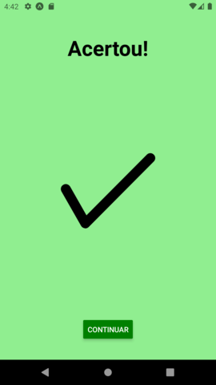

Tecnologia em Análise e Desenvolvimento de Sistemas

Setor de Educação Profissional e Tecnológica - SEPT

Universidade Federal do Paraná - UFPR

---

*DS151 - Desenvolvimento para Dispositivos Móveis*

Prof. Alexander Robert Kutzke

* [Instruções para submissão de tarefas e trabalhos](https://gitlab.tadsufpr.net.br/ds122-alexkutzke/material/blob/master/instrucoes_submissao_tarefas_e_trabalhos.md)
* [Video aula](https://www.youtube.com/watch?v=d6ZTnQNhoCo)

# Avaliação Flag Game 

Utilize o projeto já existente nesse repositório e implemente a seguinte aplicação:


A aplicação consiste em um jogo no qual o usuário deve determinar a qual país uma dada bandeira pertence. O jogo possui dois modos:

* Normal:
  - 10 perguntas em sequência. A cada acerto soma 1 ponto. Ao final, mostra-se a pontuação e dá a opção de iniciar novamente ou encerrar voltando à tela inicial.
* Temporizado:
  - Perguntas em sequência durante 30 segundos. A cada acerto soma 1 ponto. Ao final, mostra-se a pontuação e dá a opção de iniciar novamente ou encerrar voltando à tela inicial.

Sempre ao final de um jogo (10 perguntas ou 30 segundos) a pontuação do usuário deve ser salva em um webservice através de uma API (ver informações abaixo).

A aplicação ainda possui uma tela para exibição do placar de pontuação para o modo normal e o modo temporizado.

## Layout





## Imagens das bandeiras

As imagens das bandeiras podem ser requisitadas pela seguinte API pública: https://flagsapi.com/
A URL das imagens é aceita como parâmetro para o componente `Image`, portanto, **não** é necessário realizar requisições HTTP, com o `axios`, por exemplo, para exibir as imagens.

A lista dos países pode ser encontrada no array presente no arquivo `countries.js`.
Para utilizá-lo, basta utilizar um `import` similar ao seguinte:

```js
import {countries} from 'CAMINHO/PARA/countries';
```

Substitua `CAMINHO/PARA/` com o caminho correto para o arquivo.

## Biblioteca underscore.js

Para operações com Array, como [`shuffle`](https://underscorejs.org/#shuffle) e [`sample`](https://underscorejs.org/#sample), é possível utilizar a biblioteca [Underscore.js](https://underscorejs.org/). Consulte a documentação para sintaxe e funcionamento.

O arquivo da biblioteca já está presente no repositório, e pode ser importado da seguinte forma:

```js
import _ from 'CAMINHO/PARA/underscore-esm-min';
```

Substitua `CAMINHO/PARA/` com o caminho correto para o arquivo.

## API para registro da pontuação

O webservice para registro das pontuações pode ser encontrado no endereço [`http://200.236.3.126:3000/`](http://200.236.3.126:3000/).

Cada aluno da disciplina possui seus próprios endpoints, identificados a partir de seu GRR.
Os seguintes endpoints estão disponíveis:

| Método | URL                                                     | Descrição                                                                     |
|--------|---------------------------------------------------------|-------------------------------------------------------------------------------|
| GET    | http://200.236.3.126:9999/scoreboards/{GRR}/scores      | Lista pontuações salvas para o GRR informado com o jogo no modo normal.       |
| GET    | http://200.236.3.126:9999/scoreboards/{GRR}/timedscores | Lista pontuações salvas para o GRR informado com o jogo no modo temporizado.  |
| POST   | http://200.236.3.126:9999/scoreboards/{GRR}/scores      | Salva uma nova pontuação para o GRR informado com o jogo no modo normal.      |
| POST   | http://200.236.3.126:9999/scoreboards/{GRR}/timedscores | Salva uma nova pontuação para o GRR informado com o jogo no modo temporizado. |

Exemplo:

Para acessar as pontuações registradas para o jogo no modo normal, o aluno com GRR 20220000 deve utilizar o seguinte endpoint:

```
GET http://200.236.3.126:3000/scoreboards/20220000/scores 
```

Para adição de uma nova pontuação, os campos a seguir são esperados:

```
{
  name:  // nome do jogador,
  score: // pontuação do jogador
}
```

## Critérios de Avaliação

A avaliação será composta pela implementação de 3 etapas:

- (35 pontos) Primeira etapa - pontuação para jogo normal:
  - Tela de apresentação da pontuação para jogo normal; 
  - Salvamento de pontuação para jogo normal;
- (35 pontos) Segunda etapa - pontuação para jogo temporizado:
  - Tela de jogo temporizado (sem presença do cronometro);
  - Tela de apresentação da pontuação para jogo temporizado (com navegador `TabNavigator); 
  - Salvamento de pontuação para jogo temporizado;
- (30 pontos) Cronometro:
  - Adição de cronometro para tela de jogo temporizado;

Obs.: o `Cronometro` aqui mencionado seria o marcador de quantos segundos restam, que deve aparecer no topo da tela do jogo temporizado.

## Cronometro

Para implementação do cronometro e da tela de jogo temporizado, nenhuma biblioteca ou componente de terceiros poderá ser utilizado.

Como sugestão, utilize os métodos nativos `setTimeout` e `setInterval`.

## Entrega

A entrega será feita através do envio do link do repositório no Gitlab na tarefa existente na UFPRVirtual.

## Lembrando

Faça o fork do projeto, salve no seu grupo da disciplina.
Após, clone o projeto e execute o seguinte:

```
npm install
expo start
```
