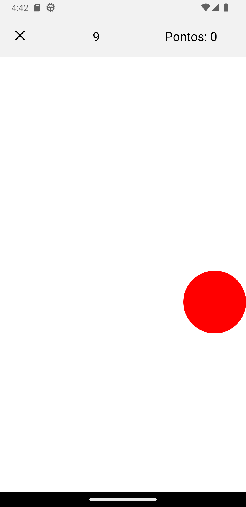

Tecnologia em Análise e Desenvolvimento de Sistemas

Setor de Educação Profissional e Tecnológica - SEPT

Universidade Federal do Paraná - UFPR

---

*DS151 - Desenvolvimento para Dispositivos Móveis*

Prof. Alexander Robert Kutzke

* [Instruções para submissão de tarefas e trabalhos](https://gitlab.tadsufpr.net.br/ds122-alexkutzke/material/blob/master/instrucoes_submissao_tarefas_e_trabalhos.md)
* [Video aula](https://www.youtube.com/watch?v=d6ZTnQNhoCo)

# Prática - TokTok Game

Utilize o projeto já existente nesse repositório e implemente a seguinte aplicação:

{width=200px} 

A aplicação consiste em um jogo no qual o usuário deve tocar o máximo de vezes, durante um período determinado de tempo, em um ícone, em movimento, na tela. 

Sempre ao final de uma partida (15 segundos) a pontuação do usuário deve apresentada. Nesse momento o usuário deve ter opções para jogar novamente ou voltar ao início. 

## Layout

{width=200px} 
{width=200px} 
{width=200px} 
{width=200px} 

## Detalhes de funcionamento

Na versão final do aplicativo, o ícone deve mudar de posição em duas ocasiões:

1) Ao toque do usuário;
2) A cada intervalo de tempo determinado por uma frequência.

A frequência inicial de mudança automática de posição do ícone deve ser de 1 segundo.

A cada toque do usuário, a frequência de mudança automática deve ser incrementada em 10%. Ou seja, o ícone deve se mover 10% mais rápido a cada toque do usuário.

## Critérios de Avaliação

A avaliação será composta pela implementação de 3 etapas:

- (35 pontos) Primeira etapa - pontuação sem temporizador:
  - Tela de jogo sem temporizador; 
  - Contabilizar cada toque como um ponto;
  - Ícone deve mudar de posição a cada toque;
- (65 pontos) Segunda etapa - pontuação com temporizador e tela de resultado:
  - Implementação do jogo completo.

## Temporizador

Para implementação temporizador, nenhuma biblioteca ou componente de terceiros poderá ser utilizado.

Como sugestão, utilize os métodos nativos `setTimeout` e `setInterval`.

## Dimensões da tela

Existem diversos métodos para descobrir o tamanho da tela (ou de um componente específico). Dentre eles, talvez o mais simples seja utilizar o evento `onLayout` de uma `<View>`. Nesse evento é possível acessar o parâmetro com informações sobre a `View` em questão. Dentre essas informações, temos a altura e a largura (em pontos) do componente. O código abaixo mostra um exemplo desse uso:

```jsx
<View onLayout={(e) => 
    console.log(e.nativeEvent.layout.width)
    console.log(e.nativeEvent.layout.height)
  }}
>
    // Conteúdo View ...
</View>
```

Vale notar que o evento `onLayout` será executado assim que o layout do componente for calculado (junto da renderização).

Mais informações aqui: https://reactnative.dev/docs/view#onlayout

## Entrega

A entrega será feita através do envio do link do repositório no Gitlab na tarefa existente na UFPRVirtual.

## Lembrando

Faça o fork do projeto, salve no seu grupo da disciplina.
Após, clone o projeto e execute o seguinte:

```
npm install
expo start
```
